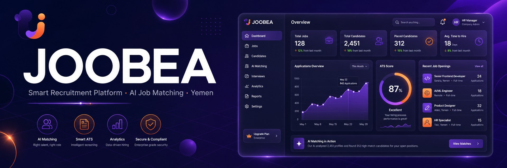
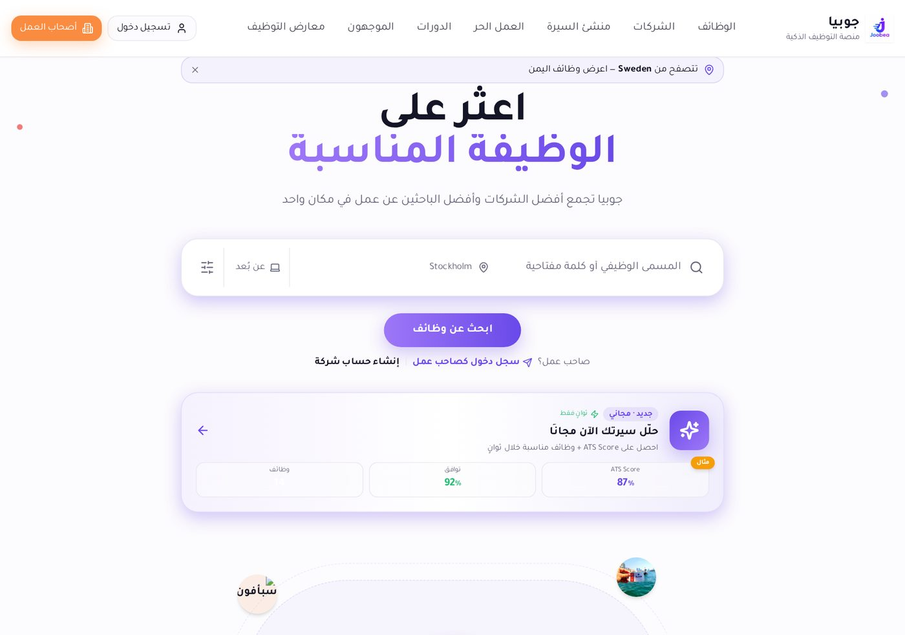
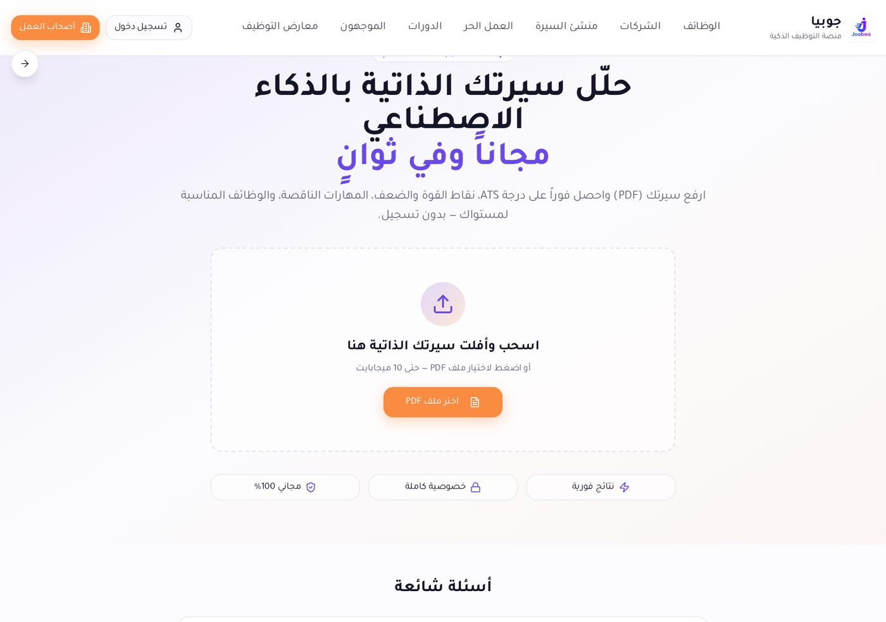
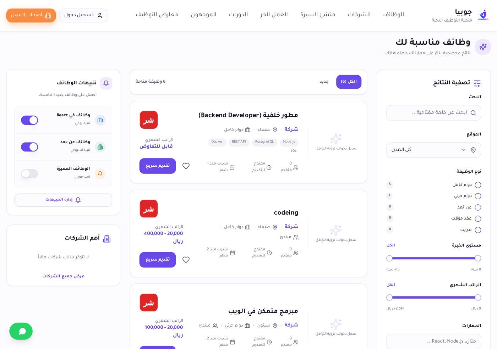
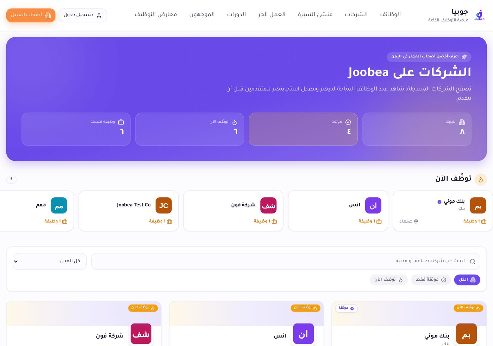
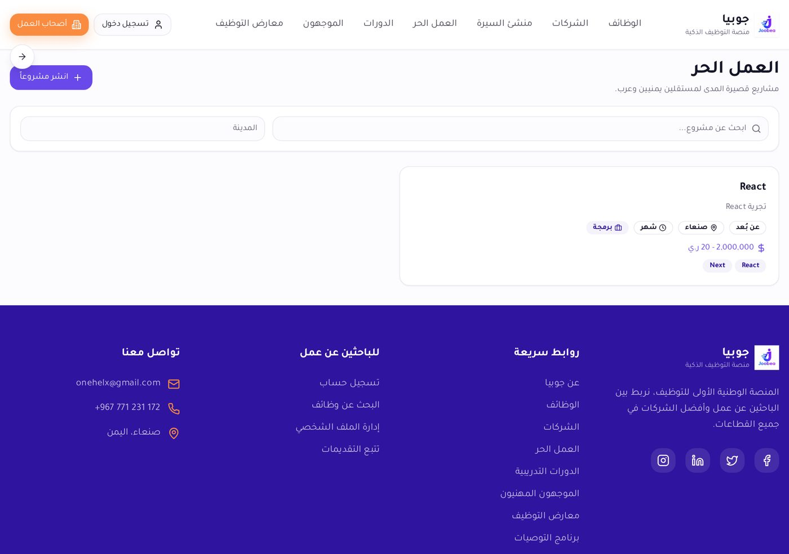
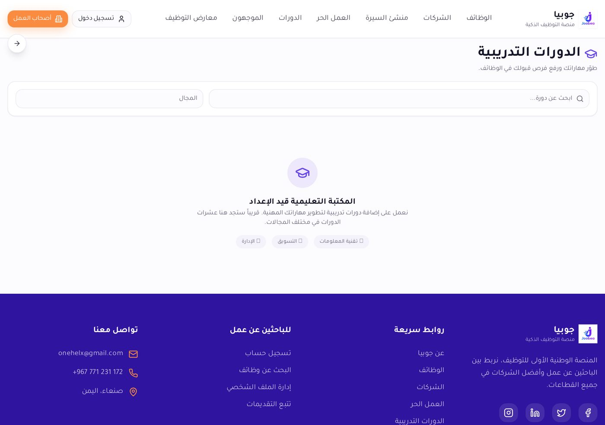
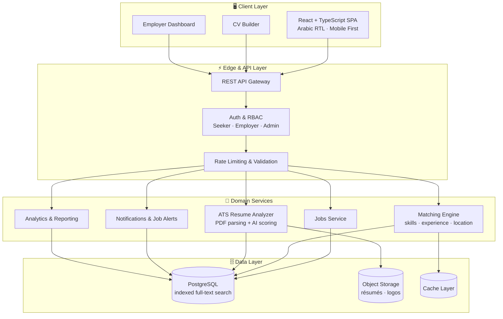
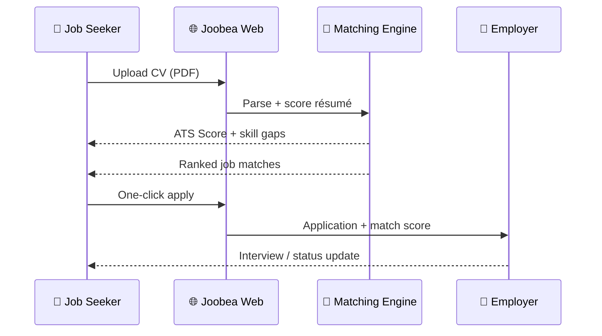

  

<h1 align="center">💼 جوبيا | Joobea 🚀</h1>
<h3 align="center">Smart Recruitment Platform for Yemen — AI Job Matching, ATS Resume Analysis & Enterprise Hiring</h3>

  
  
  
  
  

  
  
  
  
  
  
  
  

---

**Joobea** is a comprehensive, intelligent recruitment platform designed to bridge the gap between job seekers and employers in Yemen. Built with an enterprise-grade mindset, the platform streamlines the hiring process through smart matching, advanced candidate management, and a user-friendly interface.

**جوبيا** منصة توظيف ذكية متكاملة تربط الباحثين عن عمل بأصحاب العمل في اليمن، مبنية بمعايير هندسية احترافية: مطابقة ذكية للوظائف، تحليل السيرة الذاتية بالذكاء الاصطناعي (ATS Score)، لوحات تحكم للشركات، وتجربة عربية كاملة من اليمين إلى اليسار.

> 🌐 **Live production platform:** [https://joobea.com](https://joobea.com) — real users, real companies, real job postings.

---

## 👋 من أنا ولماذا بنيت جوبيا | The Story Behind Joobea

أنا **ماجد السكني**، مطوّر Full Stack من اليمن، ومؤسّس ومطوّر منصة **جوبيا**.

بدأت هذه المنصة من ملاحظة عشتها بنفسي وعاشها كل من حولي: شباب يمني يحمل شهادات ومهارات حقيقية، وشركات تبحث فعلاً عن كفاءات — والطرفان لا يجدان بعضهما. الوظائف تُنشر في مجموعات واتساب تختفي خلال ساعات، والسير الذاتية تُرسل إلى إيميلات لا يفتحها أحد، والتوظيف يعتمد على «من تعرف» أكثر من «ماذا تُتقن». في بلد نسبة البطالة فيه من الأعلى في المنطقة، هذه ليست مجرد مشكلة تقنية — هذه فرص عمل ضائعة وأسر تنتظر دخلاً.

فقررت أن أبني الحل بنفسي، سطراً بسطر.

### 🛠️ ماذا بنينا فعلاً

كتبت جوبيا من الصفر: الواجهة، الـ API، قاعدة البيانات، نظام الصلاحيات، محرّك المطابقة، ومحلّل السيرة الذاتية. لم يكن مشروع «عرض تقني» — كان عليّ أن أحل مشاكل حقيقية:

- **ضعف الإنترنت في اليمن** → بنينا واجهة خفيفة، تحميل تدريجي، وعمل كـ PWA بحيث تفتح المنصة حتى على اتصال بطيء.
- **اللغة العربية** → المنصة عربية أصلاً (RTL) وليست ترجمة ملصقة فوق قالب إنجليزي، مع دعم إنجليزي كامل.
- **السير الذاتية الضعيفة** → أضفنا محلّل CV بالذكاء الاصطناعي يعطي **ATS Score** ويشرح للباحث عن عمل بالضبط ما ينقصه ليُقبل.
- **الشركات المرهقة من الفرز اليدوي** → لوحة تحكم تفرز وترتّب المرشحين تلقائياً حسب التطابق، فيتحوّل أسبوع فرز إلى دقائق.
- **من لا يجد وظيفة بدوام كامل** → أضفنا العمل الحر، الدورات، والموجّهين، حتى يبني الشخص دخلاً ومهارة بالتوازي.

### 🎯 ماذا نريد

هدفنا ليس «موقع وظائف» آخر. هدفنا أن تكون جوبيا **البنية التحتية الرقمية للتوظيف في اليمن**: مكان واحد موثوق يجد فيه الشاب فرصته الأولى، وتجد فيه الشركة الكفاءة المناسبة بلا وساطة ولا عشوائية. كل وظيفة تُشغَل عبر المنصة هي أسرة دخلها تحسّن، ومهارة لم تُهدر، وريال بقي داخل الاقتصاد المحلي بدل أن يهاجر.

### 🚀 إلى أين نتجه

نعمل الآن على توسيع المنصة: تغطية كل المحافظات، ربط الشركات والمنظمات، بوابة توظيف للخريجين مع الجامعات، تطبيق موبايل، ومسارات تدريب تنتهي بوظيفة حقيقية لا بشهادة معلّقة على الحائط. نطمح أن نصل بجوبيا إلى مرحلة تُقاس فيها بعدد الوظائف التي وفّرتها فعلاً — لا بعدد الزوار.

هذا المشروع ليس تجربة برمجية بالنسبة لي. هو محاولة جادة، من مطوّر يمني، لأن تكون التقنية جزءاً من الحل لا مجرد حديث عنه.

**In English:**

I'm **Majid Al-Sakani**, a Full Stack developer from Yemen and the founder and engineer behind **Joobea**.

I built Joobea because I watched the same thing happen over and over: talented Yemeni graduates with real skills, and companies genuinely looking to hire — and the two sides never finding each other. Jobs get posted in WhatsApp groups and disappear within hours. CVs go to inboxes nobody opens. Hiring runs on *who you know*, not *what you can do*. In a country with one of the highest unemployment rates in the region, that isn't just a technical inefficiency — those are lost jobs and families waiting on an income.

So I decided to build the fix myself, line by line.

**What we actually built.** I wrote Joobea from scratch — the frontend, the API, the database schema, the roles and permissions, the matching engine and the resume analyzer. It was never a portfolio demo; it had to solve real constraints: weak connectivity in Yemen (lightweight UI, progressive loading, PWA), Arabic as a first-class RTL language rather than a bolted-on translation, an AI **ATS Score** that tells a candidate exactly what's missing from their CV, an employer dashboard that turns a week of manual screening into minutes, and freelance, courses and mentorship tracks for people who can't land a full-time role yet.

**What we want.** Not another job board — we want Joobea to become the digital hiring infrastructure of Yemen: one trusted place where a young person finds their first opportunity and a company finds the right person, without wasta or guesswork. Every role filled through the platform is a household with income, a skill that wasn't wasted, and money that stays inside the local economy.

**Where we're heading.** Expanding to every governorate, onboarding companies and organizations, building a university-to-employment gateway for fresh graduates, shipping a mobile app, and running training tracks that end in an actual job — not a certificate on a wall. We want Joobea measured by the number of people it put to work, not by pageviews.

This isn't a coding exercise for me. It's a serious attempt, from a Yemeni developer, to make technology part of the solution instead of just talking about it.

---

## 🌟 Key Features

| # | Feature | Description |
|---|---------|-------------|
| 🧠 | **AI CV Analyzer** | Upload a PDF resume and instantly get an **ATS Score**, strengths, weaknesses, missing skills and matching jobs — no signup required. |
| 🎯 | **Intelligent Job Matching** | Skill & experience based scoring engine that ranks opportunities per candidate profile. |
| 🏢 | **Employer Workspace** | Company accounts, job publishing, applicant tracking, candidate pipeline and hiring analytics. |
| 📄 | **CV Builder** | Built-in resume builder producing clean, ATS-friendly PDF résumés. |
| 🔎 | **Advanced Search & Filters** | Filter by city, remote, contract type, experience level, salary range and skills. |
| 🔔 | **Job Alerts** | Daily / weekly / instant alerts for new roles matching saved criteria. |
| 💼 | **Freelance Marketplace** | Dedicated section for freelance and contract-based work. |
| 🎓 | **Courses & Career Growth** | Training and upskilling section connected to market demand. |
| 🎪 | **Recruitment Fairs** | Virtual hiring events connecting companies and talent at scale. |
| 🌍 | **Geo-aware Experience** | Detects visitor country and adapts the job feed automatically. |
| 🕌 | **Native Arabic RTL** | Fully localized Arabic-first UI with correct RTL typography and layout. |
| 📱 | **Responsive & PWA-ready** | Mobile-first design, fast on low-bandwidth networks. |

---

## 📸 Platform Preview

### 🏠 Landing Page — `joobea.com`

### 🧠 AI CV Analyzer — ATS Score in Seconds

### 🔎 Jobs Board — Smart Filters & Matching

### 🏢 Companies Directory

### 💼 Freelance Marketplace

### 🎓 Courses & Training

---

## 🏗️ System Architecture

### 🔄 Candidate Journey

---

## 🛠️ Tech Stack & Engineering Highlights

| Layer | Technology | Engineering Notes |
|-------|-----------|-------------------|
| **Frontend** | React, TypeScript, TailwindCSS, Vite | Component-driven, RTL-aware design system, code-splitting and lazy routes |
| **Backend** | Python (FastAPI), REST APIs | Typed request/response models, layered service architecture |
| **Database** | PostgreSQL | Normalized schema, composite indexes, full-text search for jobs & skills |
| **Storage** | Object storage (S3-compatible) | Signed URLs for résumés and company assets |
| **AI Layer** | Resume parsing + LLM scoring | ATS score, skill extraction, gap analysis, job re-ranking |
| **Auth** | Role-based access control | Seeker / Employer / Admin separation, row-level security |
| **DevOps** | Docker, CI pipelines | Reproducible builds, automated linting and checks |
| **Performance** | Caching, pagination, image optimization | Tuned for low-bandwidth networks in the region |
| **SEO** | SSR-friendly meta, structured data, sitemaps | Indexable job pages with rich snippets |

**Engineering principles applied:** clean separation of concerns · idempotent APIs · defensive validation · observability-first logging · scalable multi-tenant data model · accessibility (a11y) and RTL correctness · security by default.

---

## 📈 Impact & Scope

- 🇾🇪 Built for the **Yemeni job market** — the first Arabic-first smart hiring experience of its kind locally.
- 🏦 Companies onboarded include banks, telecom operators and tech studios.
- 🆓 **Free** for job seekers: registration, applying and CV analysis.
- ⚡ Instant ATS feedback loop that helps candidates improve before applying.

---

---

## 🔴 Live Product Tour | جولة حقيقية داخل المنصة

> Real, unedited screenshots captured directly from the **production** platform at [joobea.com](https://joobea.com) — every screen below is live software, not a mockup.
> لقطات حقيقية ملتقطة مباشرة من المنصة أثناء عملها الفعلي على [joobea.com](https://joobea.com) — كل شاشة هنا منتج حي وليست تصميماً وهمياً.

<table>
  <tr>
    <td width="50%"> 
<b>🏠 Homepage — الصفحة الرئيسية</b> Hero, live job feed, employer CTA, RTL Arabic UI
</td>
    <td width="50%"> 
<b>🔎 Jobs Board — لوحة الوظائف</b> Faceted filters: city, type, experience, salary, skills
</td>
  </tr>
  <tr>
    <td width="50%"> 
<b>📄 Job Details — تفاصيل الوظيفة</b> Full description, skill tags, applicants counter, apply flow
</td>
    <td width="50%"> 
<b>🧠 AI CV Analyzer — محلل السيرة الذاتية</b> Free instant ATS scoring powered by AI
</td>
  </tr>
  <tr>
    <td width="50%"> 
<b>🏢 Companies — دليل الشركات</b> Company profiles, ratings and open roles
</td>
    <td width="50%"> 
<b>🔐 Auth & Onboarding — التسجيل والدخول</b> Role-based signup (seeker / employer) + email OTP verification
</td>
  </tr>
  <tr>
    <td width="50%"> 
<b>💼 Freelance — العمل الحر</b> Project-based marketplace for independent talent
</td>
    <td width="50%"> 
<b>🧭 Mentors — الموجهون المهنيون</b> Career guidance from industry professionals
</td>
  </tr>
  <tr>
    <td width="50%"> 
<b>🎓 Courses — الدورات التدريبية</b> Upskilling tracks in IT, marketing and management
</td>
    <td width="50%"> 
<b>🎪 Job Fairs — معارض التوظيف</b> Virtual hiring events connecting employers and talent
</td>
  </tr>
  <tr>
    <td colspan="2"> 
<b>ℹ️ About Joobea — عن جوبيا</b> Mission, vision and the story behind Yemen's first national hiring platform
</td>
  </tr>
</table>

### ✅ What these screens prove | ماذا تثبت هذه الشاشات

| Capability | Evidence in production | الدليل |
|---|---|---|
| Full RTL Arabic product design | Every screen renders native Arabic RTL with correct typography | تصميم عربي كامل من اليمين لليسار |
| AI / ATS resume intelligence | `/cv-analyzer` returns an instant ATS score for real CVs | تحليل ذكي فوري للسيرة الذاتية |
| Advanced search & faceted filtering | Live filters across city, contract type, experience, salary, skills | فلاتر بحث متقدمة تعمل فعلياً |
| Secure auth with email OTP | Registration issues a 6-digit, 15-minute expiring verification code | تحقق آمن عبر كود لمرة واحدة |
| Role-based access (seeker vs employer) | Separate signup paths and employer dashboards | صلاحيات مختلفة حسب نوع الحساب |
| Real data, real traffic | Live job postings from real companies with applicant counters | وظائف ومتقدمون حقيقيون |
| SEO-ready architecture | Localized meta titles, city/sector landing links, semantic HTML | بنية جاهزة لمحركات البحث |
| Monetization built in | Subscription plans, managed-hiring service and billing flow | نموذج ربحي مدمج بالفعل |

## 🚀 Roadmap

- [ ] Public REST API for partner job boards
- [ ] Mobile apps (iOS / Android)
- [ ] Semantic search with vector embeddings
- [ ] Employer AI screening assistant & interview scheduling
- [ ] Multilingual expansion (English / Arabic switch)
- [ ] Advanced market-salary intelligence dashboard

---

## 🌐 Live Demo

Visit the live platform: **[https://joobea.com](https://joobea.com)**

| Section | Link |
|---------|------|
| 🏠 Home | https://joobea.com |
| 🔎 Jobs | https://joobea.com/jobs |
| 🧠 CV Analyzer | https://joobea.com/cv-analyzer |
| 🏢 Companies | https://joobea.com/companies |
| 💼 Freelance | https://joobea.com/freelance |
| 🎓 Courses | https://joobea.com/courses |

---

## 👨‍💻 Developed By

**Majid Al-Sakani** — ماجد السكني
*Full Stack Developer | Backend Engineer | AI & Automation Specialist*

  
  

> If this project inspires you, please ⭐ **star the repository** — it helps more developers and companies discover it.

---

<!--
Keywords / كلمات مفتاحية:
Joobea, joobea.com, جوبيا, منصة جوبيا, منصة توظيف, وظائف اليمن, وظائف صنعاء, وظائف عدن, وظائف تعز, وظائف عن بعد,
smart recruitment platform, job board, jobs in Yemen, Yemen jobs, hiring platform, applicant tracking system, ATS,
ATS score, resume analyzer, CV analyzer, AI resume screening, AI job matching, job matching engine, career platform,
freelance marketplace, remote jobs, recruitment software, HR tech, HR software, e-recruitment, talent acquisition,
job alerts, CV builder, resume builder, employer dashboard, recruitment fairs, Arabic RTL web app,
React, TypeScript, TailwindCSS, Vite, Python, FastAPI, PostgreSQL, Supabase, Docker, REST API, full stack developer,
backend engineer, software architecture, scalable web application, Majid Al-Sakani, ماجد السكني, مبرمج يمني,
مطور ويب, مطور فل ستاك, مهندس برمجيات, تحليل السيرة الذاتية, الذكاء الاصطناعي, توظيف ذكي, بحث عن عمل
-->

  <em>Empowering Yemen's workforce through intelligent technology.</em> 
  <em>نُمكّن الكفاءات اليمنية عبر التقنية الذكية.</em>

