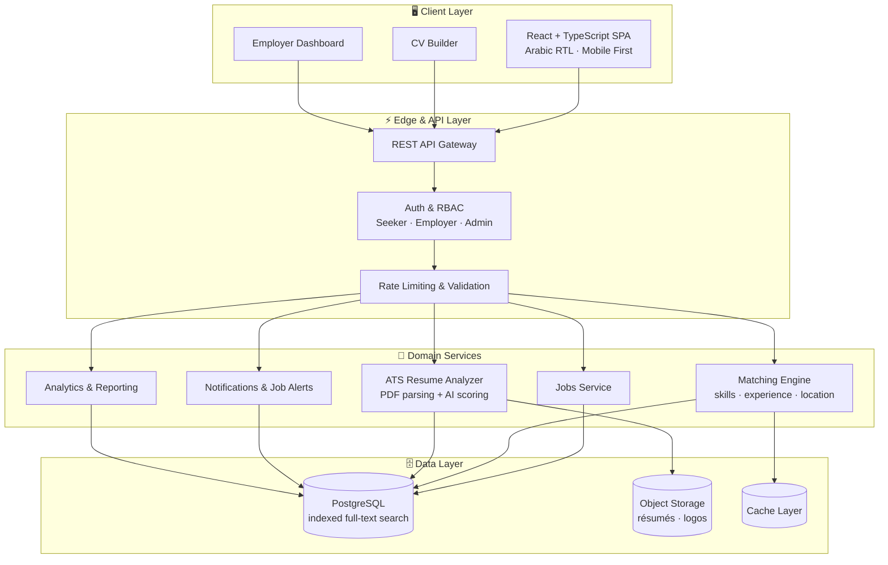
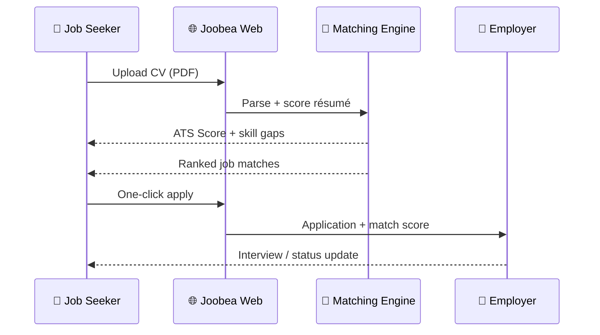

  

<h1 align="center">💼 جوبيا | Joobea 🚀</h1>
<h3 align="center">Smart Recruitment Platform for Yemen — AI Job Matching, ATS Resume Analysis & Enterprise Hiring</h3>

  
  
  
  
  

  
  
  
  
  
  
  
  

---

**Joobea** is a comprehensive, intelligent recruitment platform designed to bridge the gap between job seekers and employers in Yemen. Built with an enterprise-grade mindset, the platform streamlines the hiring process through smart matching, advanced candidate management, and a user-friendly interface.

**جوبيا** منصة توظيف ذكية متكاملة تربط الباحثين عن عمل بأصحاب العمل في اليمن، مبنية بمعايير هندسية احترافية: مطابقة ذكية للوظائف، تحليل السيرة الذاتية بالذكاء الاصطناعي (ATS Score)، لوحات تحكم للشركات، وتجربة عربية كاملة من اليمين إلى اليسار.

> 🌐 **Live production platform:** [https://joobea.com](https://joobea.com) — real users, real companies, real job postings.

---

## 🌟 Key Features

| # | Feature | Description |
|---|---------|-------------|
| 🧠 | **AI CV Analyzer** | Upload a PDF resume and instantly get an **ATS Score**, strengths, weaknesses, missing skills and matching jobs — no signup required. |
| 🎯 | **Intelligent Job Matching** | Skill & experience based scoring engine that ranks opportunities per candidate profile. |
| 🏢 | **Employer Workspace** | Company accounts, job publishing, applicant tracking, candidate pipeline and hiring analytics. |
| 📄 | **CV Builder** | Built-in resume builder producing clean, ATS-friendly PDF résumés. |
| 🔎 | **Advanced Search & Filters** | Filter by city, remote, contract type, experience level, salary range and skills. |
| 🔔 | **Job Alerts** | Daily / weekly / instant alerts for new roles matching saved criteria. |
| 💼 | **Freelance Marketplace** | Dedicated section for freelance and contract-based work. |
| 🎓 | **Courses & Career Growth** | Training and upskilling section connected to market demand. |
| 🎪 | **Recruitment Fairs** | Virtual hiring events connecting companies and talent at scale. |
| 🌍 | **Geo-aware Experience** | Detects visitor country and adapts the job feed automatically. |
| 🕌 | **Native Arabic RTL** | Fully localized Arabic-first UI with correct RTL typography and layout. |
| 📱 | **Responsive & PWA-ready** | Mobile-first design, fast on low-bandwidth networks. |

---

## 📸 Platform Preview

### 🏠 Landing Page — `joobea.com`

### 🧠 AI CV Analyzer — ATS Score in Seconds

### 🔎 Jobs Board — Smart Filters & Matching

### 🏢 Companies Directory

### 💼 Freelance Marketplace

### 🎓 Courses & Training

---

## 🏗️ System Architecture

### 🔄 Candidate Journey

---

## 🛠️ Tech Stack & Engineering Highlights

| Layer | Technology | Engineering Notes |
|-------|-----------|-------------------|
| **Frontend** | React, TypeScript, TailwindCSS, Vite | Component-driven, RTL-aware design system, code-splitting and lazy routes |
| **Backend** | Python (FastAPI), REST APIs | Typed request/response models, layered service architecture |
| **Database** | PostgreSQL | Normalized schema, composite indexes, full-text search for jobs & skills |
| **Storage** | Object storage (S3-compatible) | Signed URLs for résumés and company assets |
| **AI Layer** | Resume parsing + LLM scoring | ATS score, skill extraction, gap analysis, job re-ranking |
| **Auth** | Role-based access control | Seeker / Employer / Admin separation, row-level security |
| **DevOps** | Docker, CI pipelines | Reproducible builds, automated linting and checks |
| **Performance** | Caching, pagination, image optimization | Tuned for low-bandwidth networks in the region |
| **SEO** | SSR-friendly meta, structured data, sitemaps | Indexable job pages with rich snippets |

**Engineering principles applied:** clean separation of concerns · idempotent APIs · defensive validation · observability-first logging · scalable multi-tenant data model · accessibility (a11y) and RTL correctness · security by default.

---

## 📈 Impact & Scope

- 🇾🇪 Built for the **Yemeni job market** — the first Arabic-first smart hiring experience of its kind locally.
- 🏦 Companies onboarded include banks, telecom operators and tech studios.
- 🆓 **Free** for job seekers: registration, applying and CV analysis.
- ⚡ Instant ATS feedback loop that helps candidates improve before applying.

---

## 🚀 Roadmap

- [ ] Public REST API for partner job boards
- [ ] Mobile apps (iOS / Android)
- [ ] Semantic search with vector embeddings
- [ ] Employer AI screening assistant & interview scheduling
- [ ] Multilingual expansion (English / Arabic switch)
- [ ] Advanced market-salary intelligence dashboard

---

## 🌐 Live Demo

Visit the live platform: **[https://joobea.com](https://joobea.com)**

| Section | Link |
|---------|------|
| 🏠 Home | https://joobea.com |
| 🔎 Jobs | https://joobea.com/jobs |
| 🧠 CV Analyzer | https://joobea.com/cv-analyzer |
| 🏢 Companies | https://joobea.com/companies |
| 💼 Freelance | https://joobea.com/freelance |
| 🎓 Courses | https://joobea.com/courses |

---

## 👨‍💻 Developed By

**Majid Al-Sakani** — ماجد السكني
*Full Stack Developer | Backend Engineer | AI & Automation Specialist*

  
  

> If this project inspires you, please ⭐ **star the repository** — it helps more developers and companies discover it.

---

<!--
Keywords / كلمات مفتاحية:
Joobea, joobea.com, جوبيا, منصة جوبيا, منصة توظيف, وظائف اليمن, وظائف صنعاء, وظائف عدن, وظائف تعز, وظائف عن بعد,
smart recruitment platform, job board, jobs in Yemen, Yemen jobs, hiring platform, applicant tracking system, ATS,
ATS score, resume analyzer, CV analyzer, AI resume screening, AI job matching, job matching engine, career platform,
freelance marketplace, remote jobs, recruitment software, HR tech, HR software, e-recruitment, talent acquisition,
job alerts, CV builder, resume builder, employer dashboard, recruitment fairs, Arabic RTL web app,
React, TypeScript, TailwindCSS, Vite, Python, FastAPI, PostgreSQL, Supabase, Docker, REST API, full stack developer,
backend engineer, software architecture, scalable web application, Majid Al-Sakani, ماجد السكني, مبرمج يمني,
مطور ويب, مطور فل ستاك, مهندس برمجيات, تحليل السيرة الذاتية, الذكاء الاصطناعي, توظيف ذكي, بحث عن عمل
-->

  <em>Empowering Yemen's workforce through intelligent technology.</em> 
  <em>نُمكّن الكفاءات اليمنية عبر التقنية الذكية.</em>

